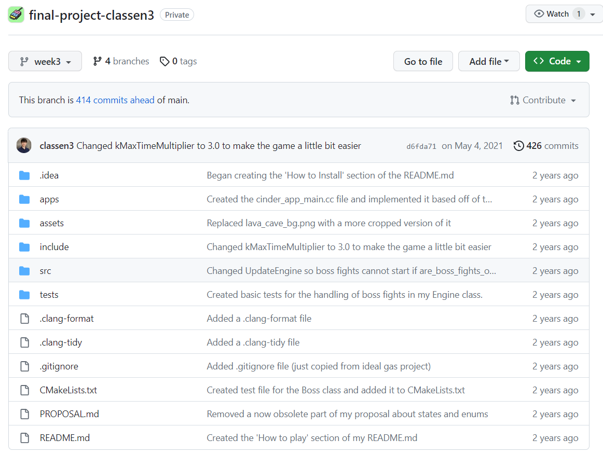

# Dino Runner Game
- This is a simple endless runner game where your goal is to survive and gain
as high of a score as you can.

## Notice (Reupload)
- This repository is a public copy of my final project for UIUC's CS126 course (which is now discontinued):  

- Although this was a school project, the only specification was only to make a Cinder application. The ideas and content present are my own original contribution.

## Dependencies
- [MSVC 2015](https://visualstudio.microsoft.com/)
- [cmake](https://cmake.org/)
- [cinder](https://libcinder.org/download)

## Only Compatible with Windows
- Other operating systems are not supported

## How to install
- Download the latest version of the [cinder library](https://libcinder.org/download) 
  for Visual C++ 2015
    - Extract this to a folder called 'Cinder'
    - If you have not built libcinder already on your computer, you can follow
    [this guide](https://libcinder.org/docs/guides/cmake/cmake.html#:~:text=To%20build%20libcinder%20with%20CLion,you%20can%20modify%20the%20CMakeCache.)
- In your 'Cinder' folder create a new directory called 'my-projects'
    - Download this project and extract it to a folder in 'my-projects'
-   Use cmake to build this cinder project
    - You can follow [this guide's](https://libcinder.org/docs/guides/cmake/cmake.html#:~:text=To%20build%20libcinder%20with%20CLion,you%20can%20modify%20the%20CMakeCache.)
  'Building your application with CMake' section
  
## How to Play
- Upon starting the game, obstacles will begin spawning on the right side of 
the screen. Touching an obstacle is an instant game over.
  - These obstacles will progressively become faster as your score increases
- Your score is displayed at the top of the screen
  - Score will increase for every second that passes while the player is alive
- There are two obstacle colors:
  - Red obstacles are indestructible but bullets can pass through them
  - Yellow obstacles can be destroyed by shooting them (the bullet is destroyed 
    with it)
- There are only two actions the player can perform
  - The player can jump over obstacles
    - Holding the jump key allows you to jump higher
  - The player can shoot, firing a fast-moving bullet
    - A maximum of 3 bullets can be on-screen at a time
- After every 25 points, a boss fight will begin
  - Your score will not increase until the boss is defeated
  - The boss can only be damaged by shooting its eye weak-spot
    - The boss's health is displayed via a red bar at the bottom of the screen
    - Each bullet that hits will subtract 1 point from the monster's health
  - Each subsequent boss will have twice as much health as the previous boss

## Controls

| Key | Action |
| ------- | --------|
| `SPACE` | Jump |
| `z` | Shoot gun |
| `x` | Start/Restart game (when in menu) |

